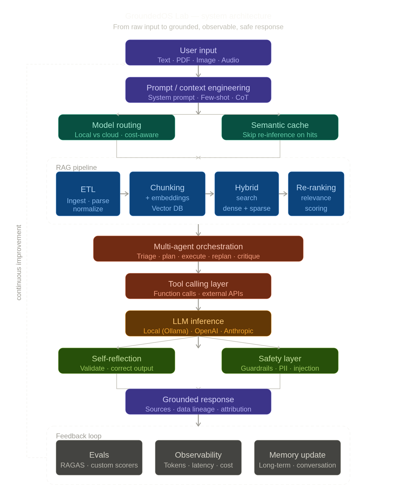

# 🧠 GroundedOS Lab

> Build, evaluate and understand grounded AI systems — from RAG pipelines to multi-agent orchestration.

**A practical learning laboratory for AI Engineering: RAG, agents, evals, observability and safety — built incrementally from a working local foundation.**

> ⚠️ This project is a learning and experimentation platform for modern AI systems.
> It intentionally exposes internal mechanics such as RAG pipelines, agent orchestration, evaluation, observability and safety layers.

---

## ⚡ Start Here

> **New here? Pick the path that fits your goal:**

| I want to… | Go to |
|---|---|
| **Try the working RAG pipeline right now** | [▶ What works today](#-what-works-today) |
| **Run it in 5 minutes** | [⚙ Quick start](#-quick-start) |
| **Understand the code end to end** | [📄 Phase 1 RAG internals guide](./docs/phase-1-rag-internals.md) |
| **Understand what we're building and why** | [🎯 Objectives](#-objectives) |
| **See the architecture** | [🏗 Architecture](#-architecture) |
| **Learn AI concepts behind the code** | [📖 Concepts](./docs/concepts/README.md) |
| **Follow a guided learning path** | [📘 Study Tracks](./docs/study-tracks/README.md) |
| **Understand key design decisions** | [📐 ADRs](./docs/adr/README.md) |
| **Contribute** | [🤝 Contributing](#-contributing) |

---

## ✅ What Works Today

> This section tracks what is **actually runnable**, not what is planned.
> Planned work lives in the [Roadmap](#-roadmap).

### Phase 0 — Data Foundation ✅ Complete

- Uniform Document Schema (`SourceDocument`, `NormalizedDocument`) in `packages/core`
- ETL pipeline ingests **text** and **PDF** files → `NormalizedDocument` with sections and lineage
- Image and audio extractors exist as registered stubs (return `NOT_IMPLEMENTED`)
- Sample dataset registered in `datasets/registry.json` with checksum and metadata
- `npm run ingest:smoke` runs the full ETL pipeline locally

### Phase 1 — Core RAG ✅ Complete

- **Upload a document** (inline text or text/PDF file) via API or CLI
- **Index** it: chunk → embed → store in local in-memory or persisted index (`.groundedos/indexes/`)
- **Ask** a grounded question: process query → retrieve top-K chunks → rerank → extractive answer → Dev Mode output
- **Dev Mode output** per request: chunk IDs, relevance scores, source metadata, offsets, embedding provider, cache, cost, workflow steps and retrieval spans
- **Embedding providers**: `api-lexical` (default, no server required), `local-hash` (deterministic), `ollama` (opt-in, requires Ollama)
- **Index management** API: list, delete persisted indexes
- Phase 1 is **complete**. Baseline metrics recorded in `datasets/golden/baselines/phase-1-baseline.json`.

### Phase 2 / 2b — Retrieval Quality + Memory ✅ Complete

- Query understanding runs before retrieval and is visible in Dev Mode
- Hybrid retrieval and reranking are implemented in the API path
- Semantic cache, cost tracking and rolling trade-off metrics are exposed through API and web
- Session-scoped memory persists locally under `.groundedos/memory/sessions/` when `sessionId` is supplied
- Hybrid-vs-dense benchmark artifact is recorded in `datasets/golden/baselines/phase-2-hybrid-benchmark.json`

### Phase 3 — Intelligence ✅ Package Baseline Implemented

- `@groundedos/agents` exposes a `DocumentQAAgent`, reasoning loop and tool registry with timeout handling
- API exposes `POST /agents/execute` for `document-qa`
- `@groundedos/safety` includes prompt-injection, PII, jailbreak, hallucination, prompt-leakage and indirect-injection guardrails
- `@groundedos/evals` includes faithfulness, relevance and recall evaluators

### Phase 4 — Lab ✅ Complete

- Prompt A/B testing is executable with `npm run experiment:prompts`
- Model/provider benchmarking is executable with `npm run benchmark:models`
- Persisted-index embedding visualization is available in the web app with
  section cluster labels
- Completed local-vs-cloud benchmark artifact: Ollama (`qwen2.5:0.5b`) + Groq
  (`llama-3.1-8b-instant`, free-tier cloud) both completed in the same run —
  `datasets/golden/baselines/phase-4-model-benchmark.json` records
  `phase4ModelBenchmarkPassed: true`

### Phase 5 — Advanced ML ✅ Complete

- Fine-tuning, LoRA and distillation each have real measured artifacts under
   `datasets/experiments/phase-5/`
- Quantization has a runnable measured lexical-vector benchmark that preserves
   retrieval quality while reducing memory; it is the current Phase 5
   quantization slice, not a full model-weight quantization pipeline
- `GET /lab/experiments` exposes Phase 5 experiment summaries through the API
   and the web lab surface

### Phase 6 — Infra/Auth Baseline ✅ In Progress

- JWT login/refresh/logout, API keys, admin-gated routes, audit logging and
   per-user rate limiting are implemented in API.
- Auth enforcement is opt-in in local dev and defaults to enabled in
   non-dev/non-test environments when `AUTH_ENFORCEMENT` is unset.
- Optional PostgreSQL-backed auth users/sessions are available with memory
   fallback (`AUTH_USER_BACKEND=postgres`, `AUTH_SESSION_BACKEND=postgres`).
- Async jobs are exposed via `/jobs/*` and processed by a BullMQ worker
   (`npm run api:jobs:worker`) when Redis is configured.

Quick async jobs flow:

```bash
# 1) Start API and worker in separate terminals
npm run api:dev
npm run api:jobs:worker

# 2) Enqueue a Phase 5 experiment
curl -X POST http://localhost:3001/jobs/phase5 \
   -H 'content-type: application/json' \
   -H 'authorization: Bearer <access-token>' \
   -d '{"track":"quantization"}'

# 2b) Same enqueue using API key
curl -X POST http://localhost:3001/jobs/phase5 \
   -H 'content-type: application/json' \
   -H 'x-api-key: <api-key>' \
   -d '{"track":"quantization"}'

# 2c) Optional: capture jobId with jq
JOB_ID=$(curl -s -X POST http://localhost:3001/jobs/phase5 \
   -H 'content-type: application/json' \
   -H 'x-api-key: <api-key>' \
   -d '{"track":"quantization"}' | jq -r '.jobId')

# 3) Poll status (replace <job-id>)
curl http://localhost:3001/jobs/<job-id> \
   -H 'authorization: Bearer <access-token>'

# 3b) Poll with API key + captured JOB_ID
curl "http://localhost:3001/jobs/${JOB_ID}" \
   -H 'x-api-key: <api-key>'
```

Quick troubleshooting (`/jobs/*`):

- `401`: include `Authorization: Bearer <access-token>` or `x-api-key`.
- `404 job not found`: check if API/worker are connected to the same Redis.
- `503 queue not configured`: set `REDIS_URL` (or `REDIS_HOST`/`REDIS_PORT`) and restart.
- Jobs stay waiting: ensure worker is running with `npm run api:jobs:worker`.

### What is NOT yet implemented

| Feature | Planned phase |
|---|---|
| OAuth / external identity providers | Phase 6+ |
| Production vector database and external observability stack | Phase 6 |
| Queue observability, retries and multi-worker orchestration | Phase 6+ |

---

## ⚙️ Quick Start

> Requirements: Node.js ≥ 20, npm ≥ 8

```bash
# 1. Install dependencies
npm install

# 2. Ask a question against the sample dataset (no config needed)
npm run rag:smoke -- --dataset phase-0-smoke-text --query "What does this command verify?"

# 3. Ask against your own file
npm run rag:ask -- --file datasets/samples/phase-0-smoke.txt --type text --query "Your question"

# 4. Start the local API server (port 3001)
npm run api:dev

# 5. Start the web interface (port 3000) in another terminal
npm run web:dev
```

Both CLI commands print a JSON response with the query, a grounded answer, retrieved chunk IDs, scores, source metadata and offsets. See [docs/phase-1-local-rag.md](./docs/phase-1-local-rag.md) for the full usage guide.

---



---

## 🎯 Objectives

GroundedOS Lab has one primary goal and two secondary ones. **Order matters** — if there is ever a conflict, the primary goal wins.

1. **Primary — practical learning laboratory**
   A hands-on environment where developers build each component of a grounded AI system from scratch, observe its internals and understand why it works. Every feature exists to teach something, not to ship a product.

2. **Secondary — architecture reference**
   A structured, documented monorepo that shows how RAG, agents, evals, observability and safety fit together in a real codebase. Decisions are recorded in [ADRs](./docs/adr/README.md) so the reasoning is visible.

3. **Tertiary — usable product**
   Once the learning foundation is solid, the system should also work as a usable local AI assistant. This is never the reason to add complexity; it is the outcome of doing 1 and 2 well.

---

## 🔁 Core Product Loop

Every feature in this project orbits a single observable loop:

```text
Upload document
   ↓
Index (chunk → embed → store)
   ↓
Ask a question
   ↓
Retrieve relevant chunks
   ↓
Generate a grounded answer
   ↓
Show sources + Dev Mode metadata
   ↓
Evaluate quality (faithfulness, relevance, latency, cost)
   ↓
Trace the full request
```

This loop is **already runnable** through local RAG, persisted indexes, reranking, trade-off metrics and session memory. Agents, guardrails and evals have package-level baselines; fine-tuning and production infrastructure remain later-phase work. Build and understand the loop first.

---

## ⚡ Local-First Philosophy

GroundedOS Lab runs **locally first**, with optional cloud integration as the project evolves.

* Enable local model execution for experimentation
* Compare local vs cloud performance
* Reduce or eliminate dependency on paid APIs during experimentation

Planned / target integrations:

* Local Transformers (quantized models)
* Ollama-based local execution (opt-in, already available for embeddings)
* OpenAI / Anthropic APIs (optional, Phase 4+)

---

## 🧩 Core Features

### 💬 AI Assistant (User Mode)

* Chat with documents, images and audio
* Grounded responses with source attribution
* Memory-aware conversations

### 🧠 Dev Mode

* Inspect:

  * retrieved chunks
  * latency
  * model routing decisions
   * orchestration steps and reasoning summaries
   * semantic cache hit/quality diagnostics
   * per-request eval scores and cost breakdown
  * grounding sources
* Toggle adaptive behavior per request:

   * multi-model orchestration
   * reasoning summary mode
   * shadow retrieval checks

### 🧪 Lab Mode

* Prompt A/B testing
* Jailbreak playground
* Model benchmarking
* Embedding visualization
* Cost analysis

---

## 🏗️ Architecture

The architecture is described at three levels of maturity. Not everything in the Target or Experimental views exists yet — see [What works today](#-what-works-today) for the running baseline.

### Current Architecture (runnable today)

```text
User Input (CLI, HTTP or Web)
   ↓
apps/api (NestJS)   or  CLI script
   ↓
packages/etl  →  NormalizedDocument
   ↓
packages/rag  →  Query Understanding + Chunks + Embeddings + Hybrid Retrieval + Reranking
   ↓
packages/observability  →  Cost + Latency + Trade-off Metrics
   ↓
packages/memory  →  Optional session memory when sessionId is supplied
   ↓
Extractive Answer + Dev Mode Output (chunks, scores, offsets, metadata)
```

This is the working loop. It produces observable output — retrieved chunks with scores and source attribution — on every request.

### Target Architecture (next planned additions)

```text
--------------------------------
| Session / Request Manager    |  ← lifecycle owner for the entire request
--------------------------------
   ↓
User Input
   ↓
Prompt / Context Engineering
   ↓
(Adaptive RAG Decision)
   ↓
--------------------------------
| RAG Pipeline                 |
| - ETL                        |
| - Chunking                   |
| - Embeddings                 |
| - Hybrid Search              |
| - Re-ranking                 |
--------------------------------
   ↓
--------------------------------
| Semantic Cache (optional)    |  ← operates on (query + retrieved context)
--------------------------------
   ↓
Model Routing                      ← context-informed: considers retrieved content,
   ↓                                 context length, cost and reasoning requirements
Multi-Agent Orchestration
   ↓
Tool Calling Layer
   ↓
LLM Inference
   ↓
Self-Reflection / Validation
   ↓
Guardrails & Safety Layer
   ↓
Response + Data Lineage
   ↓
--------------------------------
| Feedback Loop                |
| → Evaluation (Evals)         |
| → Observability              |
| → Memory Update              |
--------------------------------
```

> **Architecture notes**
> - **Session / Request Manager** owns the full request lifecycle. It is the component that will manage state across multiple tool calls in agent flows.
> - **RAG before Model Routing**: retrieved context (volume, domain, complexity) informs which model to use. Routing before retrieval loses this signal.
> - **Semantic Cache after RAG**: the cache key is `(query, retrieved_context)`, not the raw query alone. Caching the raw query produces false hits when different retrievals produce the same query string but different contexts.

### Experimental Architecture (Phase 5, separate from the core loop)

The `experiments/` folder holds independent experiments that are **not part of the request path**. They produce artifacts (fine-tuned weights, quantized models) that can later feed into Model Routing as new provider options.

```text
experiments/
  fine-tuning/    ← offline training runs, produce weights
  lora/           ← LoRA adapter training
  quantization/   ← quantize models for local inference
  distillation/   ← teacher → student model compression
  jailbreak-defense/  ← red-teaming, produces attack fixtures for packages/safety
  bias-tests/     ← produces eval fixtures for packages/evals
```

These experiments orbit the core loop — they make it better — but they are never prerequisites for the core loop to run.

---

## 🧠 Concepts Covered

Some concepts below are already implemented in the runnable Phase 0-1 loop. Others are documented and roadmapped so contributors can learn the system in the order it will be built. See [What works today](#-what-works-today) for the implementation boundary.

### 🔹 Core AI

* LLM
* Transformer
* Weights
* Context Window
* Inference

### 🔹 Retrieval & Data

* RAG
* Embeddings
* Vector Database
* Chunking
* Hybrid Search
* Re-ranking
* Knowledge Graphs (GraphRAG)
* Data Lineage

### 🔹 Context & Reasoning

* Prompt Engineering
* Context Engineering
* System Prompt
* Few-shot / Zero-shot Learning
* Chain-of-Thought (CoT)
* Self-Reflection / Self-Correction
* Grounding
* Context Pruning / Trimming
* Adaptive RAG

### 🔹 Agents & Execution

* Multi-agents
* Tool Calling / Function Calling
* Memory

### 🔹 Optimization

* Model Routing
* Quantization
* LoRA
* Distillation
* Fine-tuning

### 🔹 Generation Control

* Temperature
* Top-P / Top-K
* Tokenization

### 🔹 Data Engineering

* ETL for LLM
* Data Augmentation
* Synthetic Data Generation
* Uniform Document Schema

### 🔹 Performance

* Latency / Throughput
* Semantic Caching

### 🔹 Evaluation & Observability

* Evaluation (Evals)
* Observability
* Cost Analysis (Showback/Chargeback)
* A/B Testing of Prompts

### 🔹 Safety & Reliability

* Guardrails
* Hallucination Detection
* Bias Evaluation
* PII Stripping
* Jailbreaking Defense

### 🔹 Multimodality

* Text
* PDF
* Image
* Audio

### 🔹 Structured Systems

* Structured Outputs (planned via Pydantic / schema validation)

---

## 👥 Target Audience

GroundedOS Lab is built for:

| Audience | What you get |
|---|---|
| **AI/ML Engineers** | A structured monorepo to experiment with RAG, agents, evals, and safety in a real-world architecture |
| **Backend Engineers** | Hands-on exposure to LLM-powered pipelines, model routing, observability, and async workers |
| **Students & Researchers** | A documented learning map that connects concepts (embeddings, CoT, guardrails) directly to working code |
| **Technical Leaders** | A reference architecture for grounded AI systems, including cost tracking, evaluation and safety layers |

> ⚠️ This project assumes basic Python and TypeScript knowledge. No prior AI/ML experience is required — the goal is to build it as you learn.

---

## 🗺️ How to Learn With This Repo

Use this repository as a structured learning path:

* **New here? Start in 5 minutes:**
  → [⚡ Quick Start](#-quick-start) and [✅ What works today](#-what-works-today)

* **Want to understand what we're building?**
  → [🎯 Objectives](#-objectives) and [🔁 Core Product Loop](#-core-product-loop)

* **Interested in the hands-on module concepts?**
  → Jump to [🔬 Laboratory Modules](#-laboratory-modules)

* **Looking for evals, agents, guardrails, routing, or prompt experimentation?**
  → Browse the [`packages/`](./packages/) and [`experiments/`](./experiments/) folders — each has its own `README.md`

* **Want to understand AI concepts behind the system?**
  → Start at [`docs/concepts/`](./docs/concepts/)

* **Want a guided learning path by topic?**
  → Explore the [📘 Guided Study Tracks](./docs/study-tracks/README.md)

* **Want to understand *why* the system is built the way it is?**
  → Read the [Architecture Decision Records](./docs/adr/README.md)

* **Want to know how quality is measured?**
  → Read the [Evaluation Strategy](./docs/evaluation-strategy.md)

---

## 📘 Guided Study Tracks

Guided Study Tracks are topic-based routes through the existing GroundedOS Lab documentation, packages, experiments and roadmap phases.

Start here:

* [Track 1 - LLM Foundations](./docs/study-tracks/README.md#track-1---llm-foundations): model basics, Transformer concepts, inference, context windows and generation controls
* [Track 2 - Multi-Modal & Agents](./docs/study-tracks/README.md#track-2---multi-modal--agents): multimodal ingestion, tool calling, multi-agent flows and memory
* [Track 3 - Open-Source Ecosystem](./docs/study-tracks/README.md#track-3---open-source-ecosystem): Hugging Face, local models, quantization and inference trade-offs
* [Track 4 - Evaluation & Comparison](./docs/study-tracks/README.md#track-4---evaluation--comparison): evals, observability, cost analysis, A/B testing and benchmarking
* [Track 5 - Advanced RAG](./docs/study-tracks/README.md#track-5---advanced-rag): embeddings, chunking, vector databases, hybrid search, reranking, grounding and lineage
* [Track 6 - Fine-tuning & Adaptation](./docs/study-tracks/README.md#track-6---fine-tuning--adaptation): fine-tuning, LoRA, distillation, data augmentation, synthetic data and RLHF
* [Track 7 - Autonomous AI Systems](./docs/study-tracks/README.md#track-7---autonomous-ai-systems): planning, self-reflection, memory, multi-agent collaboration and guardrails

---

## 🔬 Laboratory Modules

### 🧪 experiment-toolkit

* Batch testing:

  * prompts
  * temperature
  * top-p
  * models

### ⚡ benchmarks

* Compare:

  * local vs cloud models
  * latency
  * cost
  * quality

### 📊 viz

* Embedding visualization (t-SNE / UMAP)
* similarity maps
* clustering

---

## 🔐 Safety Layer

* Prompt injection detection
* Jailbreak protection
* PII sanitization
* Output validation
* Grounding enforcement

---

## 🔒 Security

### Authentication & Authorization

The project currently runs without authentication (local-first, development only). Before any public deployment or multi-user access, the following must be in place:

* **API authentication** — all API endpoints require a bearer token or session cookie. No anonymous access to indexes or agent state.
* **Index ownership** — persisted indexes are scoped to a user or session identifier; one user cannot read or delete another user's indexes.
* **Role boundaries** — Lab Mode features (Jailbreak Playground, prompt A/B tests) are restricted to authenticated users with explicit opt-in.

This strategy is tracked as a Phase 6 success criterion. Implementation decisions will be recorded in [`docs/adr/`](./docs/adr/).

### Jailbreak Playground security model

The Jailbreak Playground (`experiments/jailbreak-defense/`) is a red-teaming surface that deliberately tests adversarial inputs. Before it is exposed beyond local development:

* All playground inputs are logged with the authenticated user identifier — no anonymous red-teaming.
* Playground outputs (successful jailbreaks, bypass patterns) are never exposed publicly; results are stored in `datasets/` with access controls.
* External contributors must review the security policy in `experiments/jailbreak-defense/README.md` before submitting new attack patterns.

### Multimodality (image & audio)

Image and audio extractors are registered stubs. They will re-enter the roadmap when:

1. A concrete use case is identified (e.g. PDF-with-images ingestion, audio transcription for meeting notes).
2. The relevant privacy and content-moderation implications for user-uploaded media are documented.
3. A Phase milestone explicitly includes multimodal success criteria.

---

## 📊 Observability

* Token usage
* Cost per request
* Latency per stage
* Model usage
* Error rates
* Hallucination signals
* Cache hit rate

---

## 💡 Unique Features

### 🚨 Guardrails Playground

Try to break the system and see:

* why it was blocked
* which rule triggered

### 🧩 Chunk Visualizer

See:

* which chunks were used
* relevance score
* document origin

### ⚡ Local vs Cloud Toggle

Compare:

* latency
* cost
* quality

### 🧪 Prompt A/B Testing

Compare prompts with automatic eval scoring

---

## 🗂️ Project Structure

> The monorepo scaffold below is **already created**. Each folder contains a `README.md` describing its responsibilities. Code implementation follows the roadmap phases.

```text
groundedos-lab/
  apps/
    api/        ← Backend API server (REST, local RAG, agents and metrics)
    web/        ← Frontend application (React + Vite)
    worker/     ← Placeholder for future async workers

  packages/
    core/               ← Shared types, utilities, and base abstractions
    rag/                ← Full RAG pipeline (chunking, embeddings, hybrid search, re-ranking)
    agents/             ← Multi-agent orchestration and tool calling layer
    memory/             ← Conversation and long-term memory management
    model-routing/      ← LLM routing logic (local vs cloud, cost-aware)
    safety/             ← Guardrails, PII stripping, jailbreak defense
    observability/      ← OpenTelemetry tracing, cost tracking, latency metrics
    evals/              ← Evaluation framework (RAGAS, custom scorers)
    etl/                ← Document ingestion and preprocessing pipelines
    experiment-toolkit/ ← Batch prompt testing, parameter sweeps
    benchmarks/         ← Local vs cloud model benchmarking
    viz/                ← Embedding visualization (t-SNE / UMAP)

  experiments/
    fine-tuning/        ← Full fine-tuning experiments
    lora/               ← LoRA adapter training
    distillation/       ← Knowledge distillation
    quantization/       ← Model quantization experiments
    jailbreak-defense/  ← Red-teaming and prompt injection defense
    bias-tests/         ← Bias evaluation across models and prompts

  docs/
    concepts/           ← One file per AI concept, linked to code
    adr/                ← Architecture Decision Records (why the system is built this way)
    study-tracks/       ← Guided learning routes by topic
  
  datasets/   ← Raw, processed and synthetic datasets registry
  infra/      ← Docker, Compose, K8s, environment configs
```

---

## ⚙️ Tech Stack

### Minimal stack (what you need to run it today)

No external services required for the default local path:

| Layer | What | Note |
|---|---|---|
| API server | Node.js + **NestJS** (Fastify adapter) | Runs with `npm run api:dev`. Migrated from raw Fastify; see [ADR-001](./docs/adr/ADR-001-backend-framework.md). |
| Web | **React 19 + Vite + TypeScript** | Runs with `npm run web:dev` (Vite dev server, proxies `/api` to NestJS). |
| Storage | Local JSON files (`.groundedos/`) | Persisted indexes, memory sessions and cost ledger |
| Embeddings | `api-lexical` (built-in) | Default, no server. `local-hash` and `ollama` are opt-in. |
| Retrieval | In-memory hybrid search + reranking (`packages/rag`) | No external vector DB required yet |
| Observability | Local cost tracking + trade-off metrics | No tracing server required yet |

### Target stack (planned additions, phased in)

| Layer | What | When | Notes |
|---|---|---|---|
| Database | PostgreSQL | Phase 6 | Production persistence for indexes, memory and users |
| Vector DB | **pgvector** → **Qdrant** | Phase 6 | pgvector first, migrate when needed. See [ADR-002](./docs/adr/ADR-002-vector-database.md). |
| Queue | Redis + BullMQ | Phase 3+ | API → Worker communication boundary. See [ADR-003](./docs/adr/ADR-003-api-worker-communication.md). |
| Workers | Python (ML pipelines) | Phase 3+ | Consume BullMQ jobs for compute-heavy tasks |
| Observability | OpenTelemetry + Grafana | Phase 6 | Distributed tracing, cost per stage |
| AI providers | OpenAI / Anthropic (optional) | Phase 4+ | Cloud LLM option alongside local Ollama |
| Containers | Docker + docker-compose | Phase 6 | Full local stack in one command |
| CI | GitHub Actions | Phase 6 | Lint, typecheck, test on every PR |

---

## 🧪 Roadmap

### Phase 0 — Data Foundation

* Uniform Document Schema
* Multimodal ingestion standardization
* ETL pipeline

**✅ Success Criteria:**
- [x] `packages/core` defines `SourceDocument` and `NormalizedDocument` — the [Uniform Document Schema](./docs/concepts/uniform-document-schema.md)
- [x] `packages/etl` ingests text and PDF files into `NormalizedDocument`
- [ ] Image and audio ingestion remain registered stubs for a later multimodal slice
- [x] At least one sample dataset registered in [`datasets/`](./datasets/)
- [x] ETL pipeline is runnable locally with a single smoke command

### Phase 1 — Core RAG

* Chunking
* Embeddings
* Vector DB
* Chat

**✅ Success Criteria:**
- [x] User can upload a document and ask a question grounded in its content
- [x] Local RAG smoke command can ask a question against a registered dataset
- [x] Retrieved chunks have a documented [Dev Mode output contract](./docs/phase-1-dev-mode-output.md) with relevance scores
- [x] `packages/rag` has integration tests covering the full retrieval flow
- [x] Phase 1 baseline metrics recorded in `datasets/golden/baselines/phase-1-baseline.json` before Phase 2 begins — see [Evaluation Strategy](./docs/evaluation-strategy.md)

### Phase 2 — Retrieval Quality

* Hybrid search (dense + sparse)
* Re-ranking
* Observability

**✅ Success Criteria:**
- [x] Runtime contract validation is enforced at package and API boundaries (schema-first validation layer in `packages/core`)
- [x] Query understanding runs before retrieval (rewrite, expansion, intent detection) and is visible in Dev Mode output
- [x] RAG ask execution is exposed as explicit workflow steps with per-step status and duration in Dev Mode
- [x] Semantic cache lookup is integrated before retrieval and reported in Dev Mode (`cache.hit`, similarity, hit/miss counters)
- [x] Request-level cost tracking with budget enforcement is integrated and exposed in Dev Mode (`cost.breakdown`, `totalCostUsd`, `withinBudget`)
- [x] Trade-off metrics dashboard exposes request/provider aggregates (latency, cost, grounded rate, cache hit rate) via API and web tab
- [x] Hybrid search (dense + sparse) is benchmarked against dense-only retrieval on the Phase 0 smoke dataset — Recall@3 does not regress and expected-chunk score improves in `datasets/golden/baselines/phase-2-hybrid-benchmark.json`
- [x] Re-ranking is applied and token usage / latency per stage is logged per request
- [x] Retrieval observability spans (chunk count, scores, latency) appear in the Dev Mode output

> **Note:** Persistent memory between sessions is a separate product and infrastructure concern (storage, user identity, privacy) and is tracked in Phase 2b, not here. Mixing it with retrieval quality improvements would cause one to delay the other.

### Phase 2b — Persistent Memory

* Conversation memory across sessions
* Storage backend for memory entries
* Memory read/write contracts

**✅ Success Criteria:**
- [x] Conversation memory persists and is retrievable across independent API restarts using a documented storage contract
- [x] Memory entries are associated with a session identifier; no cross-session leakage
- [x] Memory scope, retention policy and privacy implications are documented in [`packages/memory/README.md`](./packages/memory/README.md)

Implemented via `@groundedos/memory` and integrated into `POST /rag/ask` with optional `sessionId` plus `GET /rag/memory/:sessionId` for session inspection.

### Phase 3 — Intelligence

* Agents
* Tool calling
* Guardrails
* Evals
* Self-reflection / validation layer

**✅ Success Criteria:**
- [x] `@groundedos/agents`: DocumentQAAgent with tool calling and reasoning loop, API integration via `POST /agents/execute`
- [x] `@groundedos/safety`: Six-risk guardrail suite (prompt injection, PII, jailbreak, hallucination, prompt leakage, indirect injection) with GuardrailChain orchestration
- [x] `@groundedos/evals`: FaithfulnessEvaluator, RelevanceEvaluator, RecallEvaluator with per-query and aggregate scoring
- [x] Tool calling layer fully implemented in agents/src/tools.ts with registry and timeout handling
- [x] Phase 3 baseline metrics recorded in `datasets/golden/baselines/phase-3-baseline.json` (avg faithfulness 0.87, relevance 0.92, recall 1.0)
- [x] Full test coverage: 197 tests passing (added 42 new tests: 7 agents, 21 guardrails, 14 evals)

### Phase 4 — Lab

* Benchmarking
* A/B testing
* Visualization
* Model routing

**✅ Success Criteria:**
- [x] A/B prompt test runs automatically and reports winner with statistical summary (sample size, confidence interval) — `npm run experiment:prompts` writes `datasets/golden/baselines/phase-4-ab-prompt-test.json`; current result is not statistically conclusive because the golden dataset has one query
- [x] Benchmark compares at least two models (local Ollama + one cloud provider) on latency, cost and quality using the Phase 0 smoke dataset as the shared baseline — `npm run benchmark:models -- --providers local-extractive,ollama,groq` completed with Ollama (`qwen2.5:0.5b`) + Groq (`llama-3.1-8b-instant`); artifact at `datasets/golden/baselines/phase-4-model-benchmark.json` records `phase4ModelBenchmarkPassed: true`
- [x] Embedding visualization renders in the web app with section cluster labels for persisted indexes

### Phase 5 — Advanced ML

* LoRA
* Quantization
* Fine-tuning
* Distillation

**✅ Success Criteria:**
- [x] Initial deterministic scaffolds exist for fine-tuning, LoRA, quantization and distillation with documented Python environment setup
- [x] Scaffold artifacts compare baseline vs candidate variants on task-specific metrics such as faithfulness, relevance, quality, latency, memory or parameter ratio
- [x] Scaffold results are logged under `datasets/experiments/phase-5/` with input dataset, hyperparameters and output metrics recorded
- [x] Quantization track: INT8 and INT4 symmetric vector quantization with Recall@1=1.0 at 85.8% memory reduction vs FP32 baseline
- [x] LoRA track: real adapter training on GPT-2 (PyTorch + PEFT) — 294k trainable params vs 124M baseline (99.76% reduction), `comparison.passed: true`, test in `scripts/lora-experiment.test.ts`
- [x] Fine-tuning track: real SFT on GPT-2 with 6 instruction pairs from the Phase 5 retrieval dataset — loss improved 0.48 over 3 steps, all 124M parameters updated, `comparison.passed: true`, test in `scripts/sft-experiment.test.ts`
- [x] Distillation track: real teacher-student run (`gpt2` -> `distilgpt2`) with 34.17% compression and quality gate passing, test in `scripts/distillation-experiment.test.ts`

### Phase 6 — Infrastructure & Deploy

* Docker and docker-compose for local full-stack environment
* CI pipeline (lint, typecheck, test on every PR)
* Environment configuration and secrets management
* Staging deployment (optional cloud target)

**✅ Success Criteria:**
- [x] `docker-compose up` configuration exists for the full local stack (API, web, worker, Redis, Postgres)
- [x] GitHub Actions CI runs lint, typecheck and tests on every PR (`.github/workflows/ci.yml`)
- [x] `.env.example` files for root, API and web document required variables
- [x] Authentication strategy is documented (see [ADR-014](./docs/adr/ADR-014-authentication-strategy.md))

---

## 🧭 Execution Plan (Current)

Phases 0, 1, 2, 2b, 3, 4 and 5 are complete. The active
implementation focus is Phase 6 Infrastructure & Deploy.

### Current focus

- Phase 5 is complete with real runs across quantization, LoRA, fine-tuning
   and distillation artifacts in `datasets/experiments/phase-5/`.
- Current implementation focus is Phase 6 hardening:
   Docker/Compose local stack, CI gate, env standardization and auth rollout.
- Phase 6 baseline infra already landed:
   `docker-compose.yml`, `Dockerfile`, `Dockerfile.web`,
   `apps/worker/Dockerfile`, `.github/workflows/ci.yml`.
- Authentication/authorization baseline already landed:
   `POST /auth/login`, `POST /auth/refresh`, `POST /auth/logout`,
   API-key management, admin endpoints, owner scoping for indexes and memory,
   and rate limiting / audit hooks.
- Auth enforcement now follows environment defaults:
   opt-in in local development, and enabled by default in non-dev/non-test
   environments when `AUTH_ENFORCEMENT` is unset.
- Next technical priorities:
   OAuth/provider-based identity, production observability and deployment
   hardening.
- Keep roadmap checkboxes and package READMEs synchronized with implementation
   status.

The local RAG usage guide is documented in
[`docs/phase-1-local-rag.md`](./docs/phase-1-local-rag.md).
The Ollama installation and integration guide is documented in
[`docs/ollama-setup.md`](./docs/ollama-setup.md).
Reference environment files live in [`.env.example`](./.env.example),
[`apps/api/.env.example`](./apps/api/.env.example) and
[`apps/web/.env.example`](./apps/web/.env.example). Node-side commands load
local `.env` files from the repository root, and app-specific files when
applicable; shell-exported variables keep priority.

### Local RAG commands

Run a registered dataset through ETL, chunking, embeddings, in-memory vector
search and Dev Mode retrieval output:

```bash
npm run rag:smoke -- --dataset phase-0-smoke-text --query "What does this command verify?"
```

Ask a grounded question against a local text or PDF file:

```bash
npm run rag:ask -- --file datasets/samples/phase-0-smoke.txt --type text --query "What does this command verify?"
```

Both commands print JSON containing the query, a simple grounded answer,
retrieved chunk IDs, scores, source metadata and offsets.

Run the local API:

```bash
npm run api:dev
```

The first API slice exposes `GET /health`, `POST /rag/index`, `POST /rag/ask`,
`GET /rag/indexes`, and `DELETE /rag/indexes/:documentId` for inline JSON text,
multipart text/PDF uploads, selectable local embedding providers and persisted
local indexes under `.groundedos/indexes/`.
`ollama` requires a running local Ollama server and an embedding model such as
`embeddinggemma`.

Run the local web surface in another terminal:

```bash
npm run web:dev
```

The web server listens on `http://localhost:3000` and proxies requests to the
local API. Use the embedding provider select for new inline/upload requests,
`Index` to persist the current source, select saved indexes from the list, then
`Ask` to query that saved local index by `documentId`.

---

## ⚙️ Monorepo Tooling

Initial TypeScript workspace tooling is configured so Phase 0 packages can be validated locally.

**Current stack:**

| Layer | Tool | Purpose |
|---|---|---|
| Package manager | `npm` workspaces | Manage JS/TS packages |
| Type checking | `TypeScript` strict mode | Static analysis across JS/TS packages |
| Testing (JS/TS) | `Vitest` | Unit and integration tests |

**Planned additions:**

| Layer | Tool | Purpose |
|---|---|---|
| Build orchestration | `Turborepo` | Incremental builds, task pipelines |
| Python environment | `Poetry` (per package) | Isolate ML package dependencies |
| Linting (JS/TS) | `ESLint` + `Prettier` | Code style and formatting |
| Linting (Python) | `Ruff` | Fast Python linter |
| Testing (Python) | `pytest` | Unit and integration tests |
| Containers | `Docker` + `docker-compose` | Local environment |
| CI | GitHub Actions | Test, lint and build on every PR |

**Repo conventions:**

* All packages declare their dependencies explicitly — no implicit sharing
* Active TypeScript packages are validated through root build and test scripts
* The root package scripts define the current validation pipeline
* Python packages pin dependencies via `pyproject.toml` and `poetry.lock`

---

## 🤝 Contributing

### Who can contribute?

Anyone — from students exploring AI to engineers building production systems.
Contributions at all levels are welcome: documentation, experiments, package implementations, bug reports, and feature ideas.

### Getting started

1. **Fork** the repository and create a new branch from `main`
2. **Pick a phase** from the [Roadmap](#-roadmap) and check the success criteria
3. **Find or open an issue** describing what you want to work on before starting large changes
4. **Follow the folder conventions**: each package or experiment has its own `README.md` — keep it updated

### Contribution types

| Type | Where | Notes |
|---|---|---|
| AI concept documentation | `docs/concepts/` | Follow the template in [`docs/concepts/README.md`](./docs/concepts/README.md) |
| Architecture decision | `docs/adr/` | Write an ADR before implementing a hard-to-reverse decision |
| Package implementation | `packages/<name>/` | Start with the `README.md` in that package |
| Experiment | `experiments/<name>/` | Include a reproducible notebook or script |
| Dataset | `datasets/` | Include metadata (source, license, size) |
| Bug report / feature request | GitHub Issues | Use the issue templates |

### Code standards

* Write clear, self-contained code with inline comments for non-obvious logic
* Every package must have at least one test before being merged
* Use the tooling defined in [⚙️ Monorepo Tooling](#️-monorepo-tooling)
* All Python code must include type hints
* All TypeScript code must pass strict type checking

### Pull request checklist

- [ ] Branch is up to date with `main`
- [ ] Code follows the style guide for the language (see Monorepo Tooling)
- [ ] Tests pass locally
- [ ] The relevant `README.md` is updated
- [ ] The PR description explains *what* changed and *why*

### Need help?

Open a GitHub Discussion or comment on an existing issue.
No question is too basic.

---

## 📚 Purpose

GroundedOS Lab exists to help developers:

* move beyond basic AI usage
* understand real-world AI systems
* build reliable and observable pipelines
* experiment safely and systematically

---

## 🧠 What This Project Is NOT

* Not a wrapper around an LLM API
* Not just a chatbot interface
* Not a toy project

This project focuses on system design, reliability, and real-world AI engineering.

---

## ⭐ Final Thought

This is not a demo.

This is a **laboratory for understanding grounded AI systems in production.**
